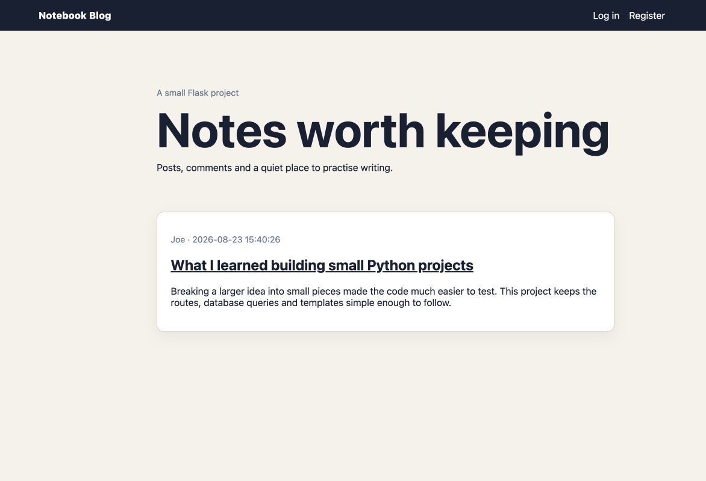

# Flask Blog

I originally completed projects from Angela Yu's 100 Days of Code course across 2021–2023. After the original files were lost during a laptop change, this project was reconstructed in 2026 with substantial AI coding assistance. The Git history represents the reconstruction and first GitHub publication, not the original course timeline.

A small full-stack Flask blog with SQLite persistence, account registration, password hashing, login sessions, author-owned posts and reader comments.



## Run

```bash
python -m venv .venv
source .venv/bin/activate
pip install -r requirements.txt
export BLOG_SECRET_KEY=choose-a-random-value
flask --app app run
```

Open `http://127.0.0.1:5000`. The local database is created automatically under `data/` and ignored by Git. Run tests with `pytest`.
